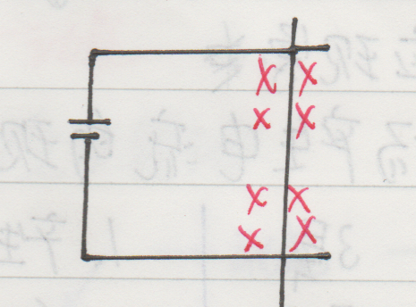

# 电磁转换

## 磁体与磁场

### 磁体

1. 磁性
	- 能够吸引铁钴镍等物质的性质
	- 能够被铁钴镍吸引的物质

2. 磁体
	具有磁性的物质叫做磁体

3. 磁极
	磁体两端的磁性最强, 这两端被称为磁极 (任何*磁体* **有且只有** 两个磁极)
	
	磁体的指向性: 将磁体用细棉线悬挂, 待其静止, 其N极指向北方, S极指向南方

4. 磁极间相互作用规律
	- 在磁体外部 (**默认**)
		+ 异名磁极相互吸引
		+ 同名磁极相互排斥
	- 在磁体内部 (通过磁场解释)
		+ 异名磁极相互排斥
		+ 同名磁极相互吸引

### 磁场

磁场是客观存在于磁体(或电流)周围的物质.

1. 磁场的基本性质:
	对放入其中的磁体(或电流)有力的作用

2. 磁场的方向:

	规定磁场中某点的方向为:
	- 在磁场中放入小磁针, 
	  小磁针静止时, N极的指向**规定**为该点磁场的方向 
	- 经过该点的磁感线在该点的切线方向为该点的磁场方向

3. 磁场的强弱:
	- 两极附近磁场最强
	- 中心部分磁性最弱
	
4. 磁感线:

	为了形象的描述磁场, 
	人们根据磁场中铁屑分布情况, 
	画一些**有方向**的**假想曲线**, 
	这些曲线叫做磁感线.
	
	- 可以通过磁感线的疏密来描述磁场的强弱
	- 某点磁感线的切线方向是该点的磁场方向
	- (在磁体外)磁感线从N极出发, 回到S极
	- 磁感线是一条闭合的曲线
	- 磁感线两两不相交

### 地磁

地球具有磁性

- 地磁的北极在**地理**南极**附近**
- 地磁的南极在**地理**北极**附近**

## 电流的磁效应 (电生磁)

### 直导线中电流的磁效应

1. 电流周围存在磁场 (奥斯特实验)

2. 其磁感线为同心圆, 该磁场没有磁极

3. 电流的磁场方向于电流方向有关
	- 通电直导线的右手螺旋定则:
		右手握住通电直导线, 
		大拇指指向电流方向, 
		弯曲的四指指向磁感线的方向.

### 通电螺线管的磁场分布

1. 两种绕法
	

2. 通电螺线管附近磁场的N,S极方向(磁场方向),
	与电流方向有关
	

3. 安培定则(右手螺旋定则)
	用右手握住通电螺线管, 
	让弯曲的四指与电流方向相同, 
	则伸直的大拇指所指的方向就是通电螺线管N极的方向

4. 通过通电螺线管类比条形磁体, 我们认识到:
	- **磁感线是闭合曲线**
	- 在磁体外部, 磁感线由N极出发回到S极
	- 在磁体内部, 磁感线由S极出发回到N极
	- 整个空间中, 磁性最强的地方是该磁体内部的中央, 这里的磁感线最密集

5. 磁极间相互作用规律
	- 在磁体外部 (**默认**)
		+ 异名磁极相互吸引
		+ 同名磁极相互排斥
	- 在磁体内部 (通过磁场解释)
		+ 异名磁极相互排斥
		+ 同名磁极相互吸引

### 环形电流的磁场

1. 环形电流附近存在磁场

2. 安培定则: 类似通电螺线管的右手螺旋定则

### 电磁铁

1. 影响电磁铁磁性强弱的因素
	- 有无铁芯, 有铁芯时磁性更强
	- 电流大小, 电流越大磁性越强
	- 匝数, 匝数越多磁性越强

2. 电磁铁的优点:
	- 可以控制磁性有无
	- 可以控制磁性大小
	- 可以控制磁场方向

3. 应用: 电磁继电器
	- 在电路中相当于开关
	- 工作电路分为控制电路和受控电路
	- 优点: 可以通过低电压小电流的控制电路
			控制高电压大电流的受控电路
	- 组成:
		+ 电磁铁
		+ 弹簧
		+ 衔铁

## 磁场对电流的作用力

### 磁场对通电导体的作用力

1. 作用力的方向与磁场方向, 电流方向有关

2. 左手定则:
	伸开左手放入磁场中, 
	让磁感线从掌心穿入, 
	让伸直的四指指向与电流方向一致, 
	则大拇指所指方向为电流受磁场作用力的方向.
	(作用力的方向既垂直于磁场方向, 又垂直于电流方向)

### 应用: 直流电动机

1. 组成: 线圈, 磁体, 换向器, 电刷

2. 平衡位置: 线圈平面与磁场方向垂直时, 
		线圈受磁场作用力平衡, 
		不会转动.
	

3. 工作原理: 通电线圈在磁场中受力转动

4. 换向器
	- 问题在于线圈受磁场作用力可能为阻力, 导致线圈来回转动
	
	- 我们可以在通过平衡位置时改变线圈中电流方向, 
		让磁场作用力一直是动力, 而非阻力
	
	- 换向器: 由两个彼此绝缘的半圆形铜片组成
	- 作用: 当线圈处于平衡位置时改变线圈中的电流方向
	

5. 简易电动机模型:
	
	
	*磁场已省略*

	在简易电动机模型中, 
	将线圈两端的线头绝缘漆各刮去同侧的一半, 
	来替代换向器的作用.

	作用: 当作用力是阻力时, 切断电流.

## 电磁感应 (磁生电)

### 电磁感应现象

1. 利用磁场, 产生电流的现象叫做电磁感应现象.

2. 感应电流: 

	电磁感应现象中产生的电流叫做感应电流

3. 产生感应电流的条件: 

	**闭合电路**中的部分**导体**做**切割磁感线**运动
	
4. 决定感应电流方向的因素:
	- 磁场方向
	- 切割运动方向

5. 右手定则:
	
	伸平右手, 让大拇指与四指垂直,
	让磁感线从掌心伸入, 
	大拇指指向导体切割运动方向, 
	四指指向就是电流方向

### 发电机的原理

1. 组成: 线圈, 磁体

2. 工作原理: 电磁感应

线圈在磁场中做切割磁感线运动时, 
线圈中产生的是大小和方向随时间周期性变化的交变电流.

我国的家庭电路中交变电流的频率为50Hz.
(电流1s内产生周期变化的次数为50次, 周期为0.02s)

### 发电机与电动机的对比

| | 发电机 | 电动机 |
| :- | :-: | :-: |
| 相同点 | 有线圈和磁体 | 有线圈和磁体 |
| 原理 | 电磁感应 | 通电线圈在磁场中受力转动 |
| 能量转化 | 机械能转化为电能 | 电能转化为机械能 |
| 作用 | 在电路中作为电源 | 在电路中作为用电器 |
| 简化电路 |  |  |

