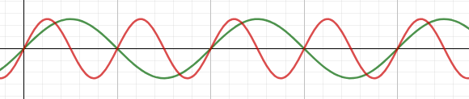
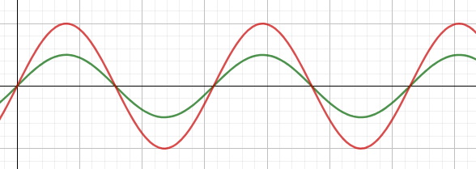
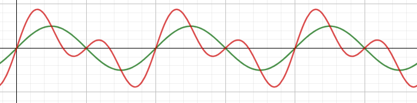

# 声现象

## 声音的产生与传播

1. 声音的产生是由于声源的振动
2. 声音的传播需要介质
	真空不能传声
	一般地\\(v_固 > v_液 > v_气\\)
3. 声音可以被反射，可以被吸收。

## 声音的特性

1. 音调

	音调与声源振动的频率有关，即声源振动的快慢
	单位为赫兹(Hz)

2. 响度

	响度与声源振动的幅度有关，即声源振动的强弱
	单位为分贝(dB)

3. 音色

	音色与发声体的材料和结构有关
	一般地，我们通过音色区分不同的人和不同的乐器

## 声音的分类

1. 从物理上讲，
	发声体做有规律振动产生的声音为乐音，
	做无规则运动产生的声音叫噪声。

2. 减弱噪声：
	- 声源处
	- 传播过程中
	- 人耳处

## 波形图

1. 音调

如图，两个波的响度和音色相同，
	但音调不同（红色音调较高，绿色音调较低）

2. 响度

如图，两个波的音调和音色相同，
	但响度不同（红色响度较大，绿色响度较小）

3. 音色

如图两个波音色不同。

## 影响声音特性的因素

1. 弦乐

	弦越细，越短，其音调越高。

2. 瓶中装水
	- 吹：空气柱振动发声，水越多，空气柱越短，音调越高
	- 敲：瓶子与水振动发声，水越多，水柱越长，音调越低
	
3. 尺子
	
	尺子伸出桌子部分越长，音调越低

## 机械波与电磁波的对比
- 相同:
	1. 都是波，具有波长，频率，振幅等物理量
	2. 都具有反射，折射等现象

- 不同：

| | 机械波 | 电磁波 |
| :-: | :-: | :-: |
| 例子 | 声波 | 光 | 
| 特有的特性 | 音色 | | 
| 传播 | 需要介质 | 不需要介质 |
| 波速 | 空气中声波速一般为\\(340m/s\\) | 真空光速约为 \\(3\times 10^8 m/s\\) |
| 应用 | 倒车雷达 B超 声呐 超声波碎石 | 广播 雷达 遥控器 光纤 |
